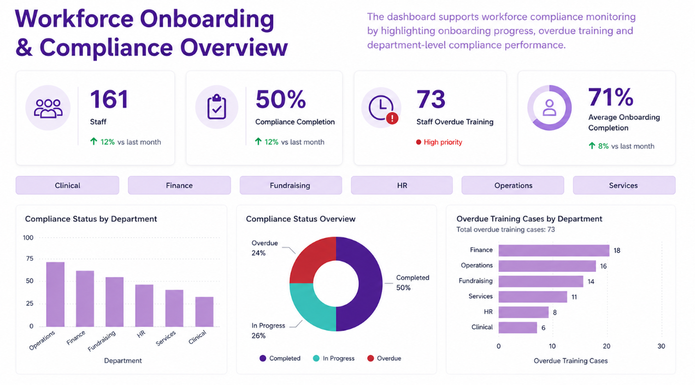

# Workforce Onboarding & Compliance Dashboard

Power BI dashboard concept based on real workforce onboarding and compliance monitoring processes. Designed to track staff onboarding progress, compliance completion, and overdue training across departments using executive-style KPI reporting and modern dashboard design.

## Dashboard Preview

## Key Features

- Workforce KPI reporting
- Compliance completion monitoring
- Overdue training analysis
- Department-level insights
- Executive dashboard layout
- HR analytics visualisation

## Dashboard Metrics

The dashboard includes:
- Total workforce overview
- Compliance completion percentage
- Overdue training tracking
- Average onboarding completion
- Department-level compliance analysis

## Tools Used

- Power BI
- DAX
- Data Visualisation
- Dashboard UX/UI Design

## Project Purpose

This project was created to demonstrate:
- HR and workforce analytics
- Compliance reporting
- KPI dashboard development
- Executive reporting design
- Data storytelling and visual communication
